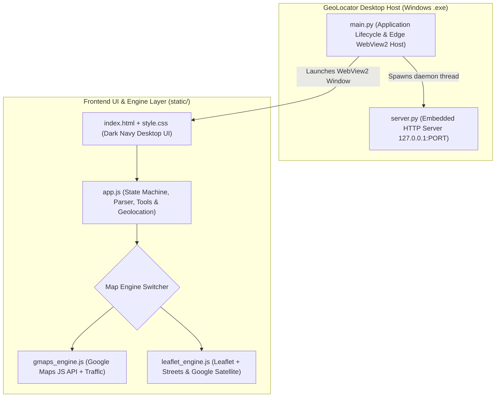

# 📍 GeoLocator Pro - Desktop Geographic Coordinate Locator & Map Toolkit

[](https://github.com/gerardorflammia/geo-locator)
[](https://python.org)
[](https://developers.google.com/maps)
[](LICENSE)

**GeoLocator Pro** is a standalone Windows desktop application designed for searching, pinpointing, analyzing, and exporting geographic coordinates (Latitude and Longitude) on interactive maps. It features a native dual-engine architecture combining the **Google Maps JavaScript API** and **OpenStreetMap (Leaflet)** with high-definition Streets and Google Satellite layers, real-time elevation profiling, distance measurement, coverage radius calculation, and instant mobile QR handoff.

The entire application runs **100% locally** on the user's workstation (`127.0.0.1`), requiring zero external backend servers while ensuring a secure context for modern Web APIs (Geolocation, Clipboard, and Storage).

---

## 🌟 Key Features

### 1. 🔍 Universal Coordinate Input & Multi-Format Parser
- **Universal Coordinate Parser**: Automatically detects and parses:
  - Standard Decimal Degrees (DD): `10.4806, -66.9036` or `10.4806 -66.9036`
  - Hemispheric Notation: `10.4806 N, 66.9036 W`
  - Degrees, Minutes, Seconds (DMS): `10° 28' 50.16" N, 66° 54' 12.96" W`
  - Tagged strings: `lat: 10.4806, lng: -66.9036`
- **Dual Display**: Formats coordinates simultaneously in **Decimal Degrees (DD)** and **Degrees Minutes Seconds (DMS)** with one-click clipboard copying.

### 2. 🗺️ Dual Engine: Google Maps & OpenStreetMap
- **Google Maps JavaScript API Engine**:
  - Official Google Maps rendering with Road and High-Resolution Satellite (Hybrid) layers.
  - Live **Real-Time Traffic Layer** toggle (`google.maps.TrafficLayer`).
  - Google Places and Geocoder integration.
  - In-app Google Cloud API Key manager and local `config.js` support.
- **OpenStreetMap / Leaflet Engine** (100% Free & Zero-Config):
  - **Streets**: Standard high-contrast cartography.
  - **Google Satellite**: Ultra-high-resolution global satellite photography with street overlays.

### 3. 🎯 High-Precision Geolocation ("My Location")
- Detects the workstation's real-time position using the HTML5 Geolocation API (`enableHighAccuracy: true`).
- Renders an animated pulse beacon with an accuracy circle in meters.
- Includes an automatic public IP-based network fallback so users are always oriented even without dedicated GPS hardware.

### 4. 📐 Advanced Geographic Toolkit
- **📏 Distance Ruler Tool**: Click multiple waypoints on the map to measure cumulative distances with dynamic dashed polylines and live meter/kilometer readouts.
- **⭕ Coverage Radius Circle**: Draw an adjustable circular zone (from 100m to 25 km) around the active pin with a real-time slider for coverage analysis.
- **⛰️ Sea-Level Elevation**: Fetches terrain altitude above sea level (meters and feet) for any selected point via Open-Meteo elevation data.
- **🎯 Center Crosshair**: Toggleable high-contrast reticle for pinpoint geographic targeting.
- **🖱️ Live Cursor Tracking**: Bottom status bar displaying real-time coordinates under mouse hover.

### 5. 📱 Mobile Transfer & GIS Data Export
- **Instant QR Code**: Generates a scannable QR code directly on screen so mobile devices can open the coordinates in Google Maps, Apple Maps, or Waze immediately.
- **Direct Navigation Buttons**: Quick one-click links to Google Maps Web and Waze navigation.
- **GIS Export Formats**:
  - **GeoJSON (`.geojson`)**: Universal standard for QGIS, ArcGIS, and web mapping.
  - **Google Earth KML (`.kml`)**: 3D globe visualization.
  - **GPS Exchange Format (`.gpx`)**: Waypoint files for Garmin receivers, drones, and outdoor navigation units.

### 6. ⭐ Bookmarks & Local Storage
- Save frequent waypoints with custom labels (e.g., *"HQ Office"*, *"Warehouse B"*, *"Field Site 4"*).
- Instant jump-to-location and local persistence via browser `localStorage`.

---

## 🚀 How to Run

### Method 1: Standalone Windows Executable (Recommended)
Double-click **`GeoLocator.exe`**.
- No Python installation required.
- Launches a native Windows desktop window using Edge WebView2.
- Automatically cleans up background server processes upon window exit.

### Method 2: Batch Launcher
Double-click **`run.bat`**.

---

## 🏗️ Architecture & Technology Stack



- **Backend / Host**: Python 3.14 + `pywebview` (WinForms + Edge Chromium WebView2 backend).
- **Frontend**: Vanilla ES6 JavaScript, HTML5 semantic structure, CSS3 responsive grid with glassmorphism.
- **Packaging**: `PyInstaller 6.22` with `--onefile` and `--noconsole`.

---

## 📂 Project Structure

```text
geo-locator/
│
├── GeoLocator.exe          # Standalone Windows executable binary
├── run.bat                 # Quick launch script
├── main.py                 # Desktop window entrypoint and WebView2 controller
├── server.py               # Embedded local HTTP server (127.0.0.1)
├── build_exe.py            # Automated PyInstaller packaging script
├── requirements.txt        # Python dependencies
├── test_app.py             # Server lifecycle & endpoint test suite
├── test_coords.js          # Coordinate parser unit test suite
├── README.md               # English documentation
├── README_ES.md            # Spanish documentation
│
├── dist/
│   └── GeoLocator.exe      # Compiled distribution binary
│
└── static/                 # Embedded Frontend Assets
    ├── index.html          # Main application user interface
    ├── css/
    │   └── style.css       # Modern dark-theme desktop styling
    └── js/
        ├── app.js              # Main application orchestrator
        ├── config.example.js   # Configuration template for Google Maps API Key
        ├── gmaps_engine.js     # Google Maps JavaScript API adapter
        └── leaflet_engine.js   # Leaflet / OpenStreetMap adapter
```

---

## 🔨 Building from Source

To compile the application into a standalone `.exe`:

1. Install Python 3.10+ (tested with Python 3.14).
2. Install dependencies:
   ```bash
   pip install -r requirements.txt
   ```
3. Run the automated build script:
   ```bash
   python build_exe.py
   ```
4. The compiled executable will be generated at `dist/GeoLocator.exe`.

---

## 🧪 Testing

Run the included automated verification suites:
```bash
python test_app.py
node test_coords.js
```

---

## 📄 License
Released under the [MIT License](LICENSE).
